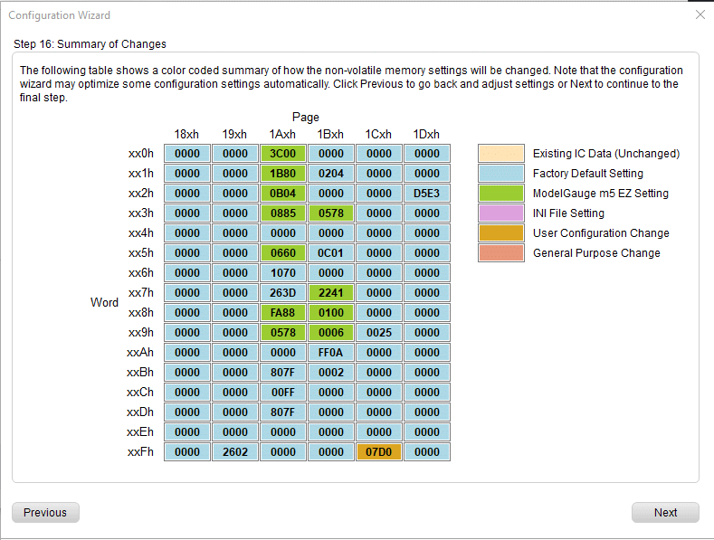
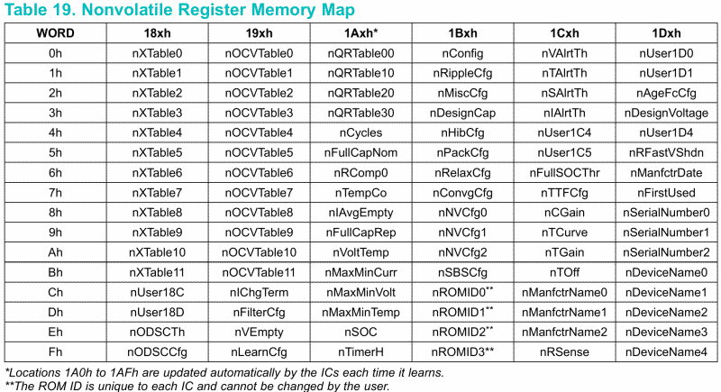

# Configuration
The struct `Max1720xConfiguration` contains the parameters stored in registers and is initialized with the default values (see datasheet page 87 - table 22 'Nonvolatile Memory Configuration Options').

The value of capacity is the actual capacity of the battery in mAh! The values for the capacity registers (designCap, ...) are calculated in the configure method.

Custom configuration values can be obtained from the datasheet or by using the wizard from the [MAX172xx Fuel Gauge EV Kit Software](https://www.maximintegrated.com/en/design/software-description.html/swpart=SFW0001490D) and then by copying the register values into the corresponding variables.

The `configure` method will first read out the actual configuration from the device before writing. Then the configuration of the device will be updated by writing but only if there were changes in the configuration. After that the new configuration is applied by performing a 'reset'.

This way the microcontroller can be turned off / reset without having to worry that the battery gauge will lose already learned and calculated information about the battery status.